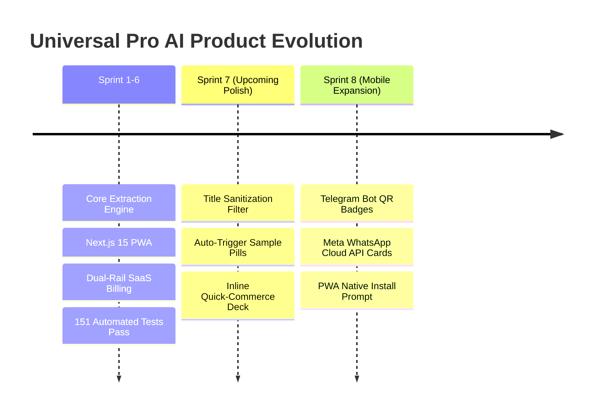

# 🛡️ Product Owner Governance & Working Protocol

> **Folder Location:** `D:\Personal Projects\recipe-extractor\PO Recommendation\`  
> **Dedicated Purpose:** Persistent artifact storage for PO-Agent reviews, sprint showcases, backlog prioritization, and UX studies.

---

## 📌 PO-Agent Operational Rules

Going forward, whenever **PO-Agent** is invoked, all analysis documents, UX audits, feature specifications, PRDs, and test reports will be maintained inside this folder (`PO Recommendation/`).

### Standard Governance Artifacts in this Folder:
1. [`PO_MASTER_UX_AUDIT_AND_RECOMMENDATIONS.md`](file:///D:/Personal%20Projects/recipe-extractor/PO%20Recommendation/PO_MASTER_UX_AUDIT_AND_RECOMMENDATIONS.md): Comprehensive PO review of live web app (`universal-pro-ai.vercel.app`), visual design audit, and prioritized feature backlog.
2. [`REEL_EXTRACTION_TEST_REPORT.md`](file:///D:/Personal%20Projects/recipe-extractor/PO%20Recommendation/REEL_EXTRACTION_TEST_REPORT.md): Detailed end-to-end report for Instagram Reel extractions (`https://www.instagram.com/reel/DdGvPs9zhVu/`), pipeline latency, and model failover verification.
3. `PO_GOVERNANCE_AND_ROADMAP.md`: Operational protocol and roadmap index.

---

## 🛣️ Future Product Roadmap (Sprints 7 & Beyond)

