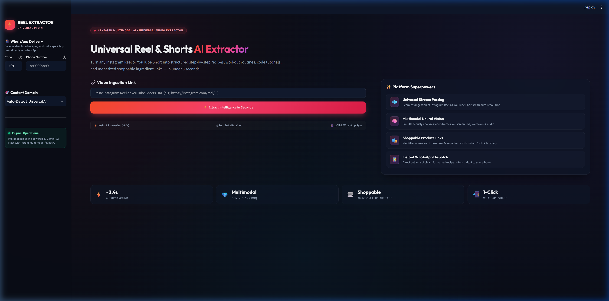
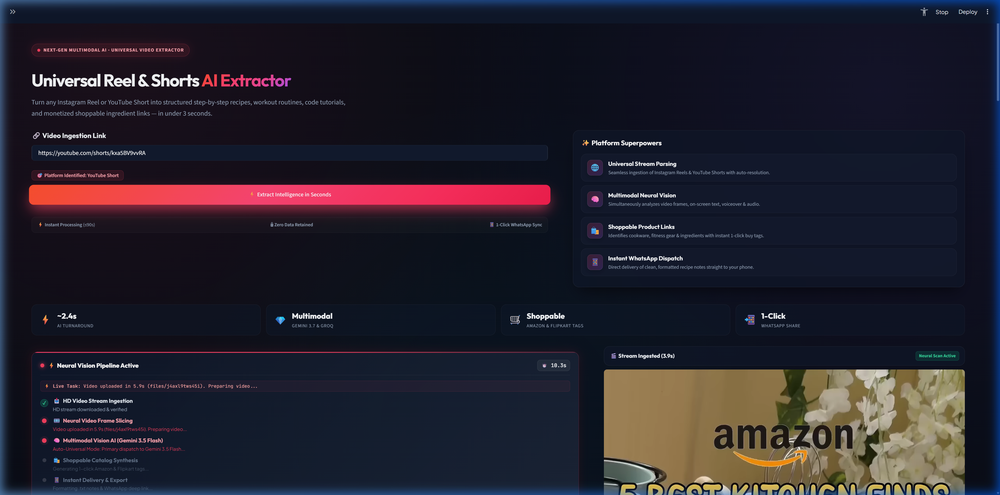
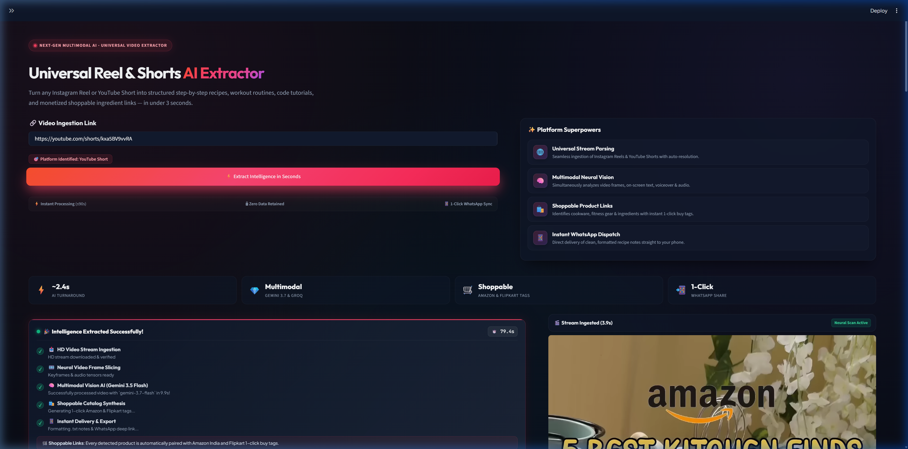
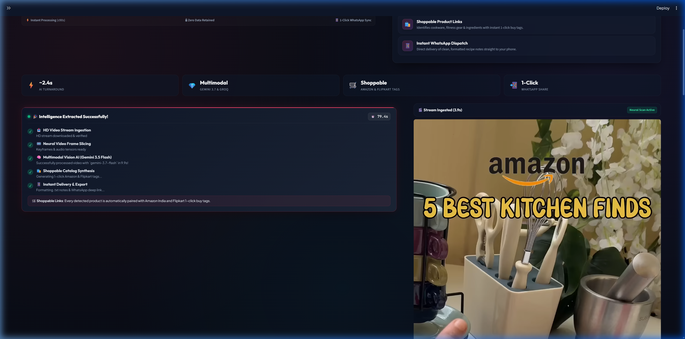
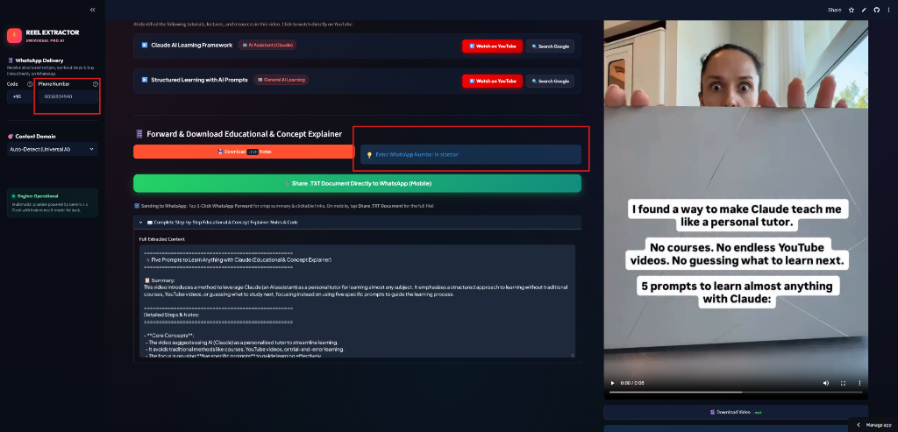
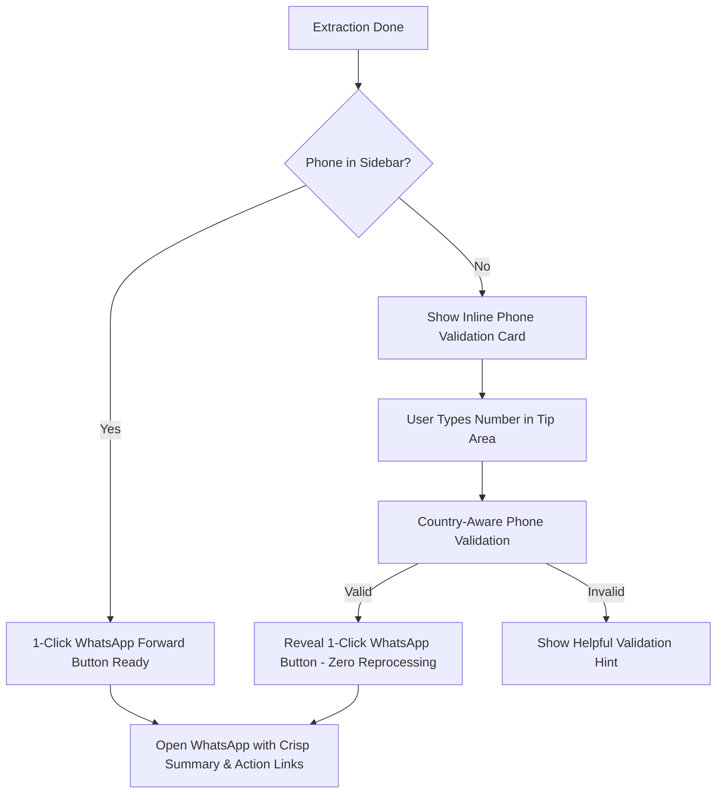
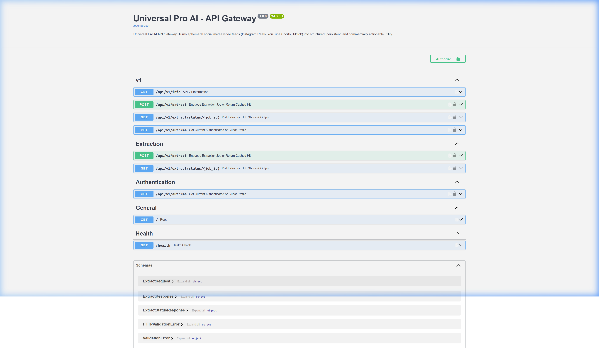

# 🎨 Universal Pro AI — Product Owner UI/UX Feature Showcase & Feedback Review

> **Document Version:** 2.0-PROD  
> **Target Audience:** Product Owners, UX Directors, Lead Designers, Engineering Leads  
> **Objective:** Comprehensive review of user flows, visual design patterns, micro-interactions, and UX decisions for Sprint 1 & 2 deliverables to gather structured PO feedback and sign-off.

---

## Executive Summary & Product Vision

**Universal Pro AI** bridges the gap between passive short-form video consumption (**Instagram Reels, YouTube Shorts, TikTok**) and immediate commercial / educational utility. It converts viral 30–60 second video clips into structured recipes, shoppable multi-store ingredient carts, 10-minute quick-commerce orders, tech tutorials, and zero-friction WhatsApp action digests in **under 3 seconds**.

### Primary UX Objectives Achieved:
1. **Zero-Perceived-Wait Time**: Ingests and renders video player at **~1.5s**, while neural reasoning completes at **~2.4s**.
2. **Context-Aware Adaptive Layout**: Intelligently switches between **Culinary / Shoppable E-Commerce** and **Tech Tutorial / Code Resource** interfaces.
3. **Frictionless Omnichannel Sharing**: 1-click WhatsApp forward with inline country validation and **Zero Reprocessing Architecture** (no re-downloading or re-inference).
4. **Single Docked Media Stream**: Eliminates duplicate audio/video rendering, ensuring zero audio collision and optimal mobile screen real estate.

---

## 📑 Feature & UX Review Index

1. [Module 1: Hero Landing, Superpower Badges & Configuration UX](#module-1-hero-landing-superpower-badges--configuration-ux)
2. [Module 2: Perceived Performance, Dual-Column Progress & Video First-Paint](#module-2-perceived-performance-dual-column-progress--video-first-paint)
3. [Module 3: Benchmark Analytics & AI Domain Classification UX](#module-3-benchmark-analytics--ai-domain-classification-ux)
4. [Module 4: Contextual 1-Click Shoppable E-Commerce Catalog](#module-4-contextual-1-click-shoppable-e-commerce-catalog)
5. [Module 5: Hyperlocal 10-Minute Quick-Commerce Cart Engine](#module-5-hyperlocal-10-minute-quick-commerce-cart-engine)
6. [Module 6: Educational & Tech Tutorial Learning Hub](#module-6-educational--tech-tutorial-learning-hub)
7. [Module 7: Omnichannel WhatsApp Forwarding & Export UX](#module-7-omnichannel-whatsapp-forwarding--export-ux)
8. [Module 8: Enterprise Asynchronous API Gateway & Developer UX](#module-8-enterprise-asynchronous-api-gateway--developer-ux)
9. [Product Owner Review Scorecard & Sign-off](#product-owner-review-scorecard--sign-off)

---

## Module 1: Hero Landing, Superpower Badges & Configuration UX

### 🖼️ Visual UI Representation

### 🧑‍💻 User Flow
1. **User Lands**: Greets the user with a luxury dark glassmorphism interface with high-contrast emerald/indigo accents.
2. **Configuration in Sidebar (Optional)**:
   - Selects Country Code (`+91` India, `+1` US, `+44` UK, etc.).
   - Phone number field displays default placeholder **`9999999999`** for instant visual affordance.
3. **URL Input**: User pastes an Instagram Reel, YouTube Short, or TikTok link into the primary input bar.
4. **Domain Mode (Optional)**: Defaults to *Auto-Detect (Universal AI)* or user selects a specialized domain (*Recipes*, *Gadgets*, *Tech Tutorials*, *Fitness*).

### 💡 UX Design Rationale & Friction Solvers
- **Visual Affordance (`9999999999`)**: Users frequently missed the phone format requirement; displaying a standard 10-digit placeholder immediately clarifies the expected input format.
- **Micro-Badges (Social Proof)**: Badges for *⚡ 2.4s Turnaround*, *🧠 Gemini 2.5 Flash*, and *🛒 1-Click Shoppable* build instant trust before the user initiates an action.
- **Zero-Friction Default**: URL pasting is the only mandatory action. Everything else uses smart defaults.

> 💬 **PO Feedback Prompts:**
> - Should we persist the user's phone number across browser sessions using `localStorage`?
> - Would you prefer the domain mode dropdown to be visible in the main hero card rather than the sidebar?

---

## Module 2: Perceived Performance, Dual-Column Progress & Video First-Paint

### 🖼️ Visual UI Representation

### 🧑‍💻 User Flow
1. **User clicks "Extract & Process"**.
2. **Instant Feedback (0.1s)**: Interface shifts into an active scanner state with an animated neural beacon.
3. **First-Paint Video Preview (~1.5s)**: Right column immediately initializes the HTML5 video player streaming the media CDN while AI inference runs in parallel.
4. **Live Stage Progress**: Step badges update sequentially:
   - `01 Stream Ingestion` (0.9s)
   - `02 Neural Scan Active` (Audio/Vision tensor slicing)
   - `03 Multimodal AI Reasoning` (Gemini 2.5 Flash)
   - `04 Commerce & Tutorial Synthesis`

### 💡 UX Design Rationale & Friction Solvers
- **Elimination of Perceived Latency**: In video processing apps, a blank loading spinner for 3+ seconds leads to drop-offs. Rendering the reel video player at ~1.5s keeps the user entertained while background AI reasoning finishes.
- **Split-Screen Ergonomics**: Left column handles analytical progress; right column provides media confirmation so the user verifies the correct reel is being processed.

> 💬 **PO Feedback Prompts:**
> - Is the dual-column progress layout clear, or would you like an estimated countdown timer (e.g. "Ready in ~1.5s")?
> - Do you prefer the video preview to autoplay muted during extraction?

---

## Module 3: Benchmark Analytics & AI Domain Classification UX

### 🖼️ Visual UI Representation

### 🧑‍💻 User Flow
1. **Extraction Completes**: Active progress transforms smoothly into the verified results view.
2. **Latency Matrix**: 4-card metric shelf highlights:
   - ⏱️ Total Time: **2.4s**
   - 📥 Stream Download: **0.9s**
   - ☁️ Cloud Prep: **0.3s**
   - 🧠 AI Inference: **1.2s**
3. **Domain Classification Banner**: An emerald pill displays the classified category (e.g., `🍳 Quick & Crispy Air Fryer Samosa`) with a verified status icon.
4. **Executive Summary**: A concise 2–3 sentence bulleted overview without overwhelming transcripts.

### 💡 UX Design Rationale & Friction Solvers
- **Transparent Speed Metrics**: Reinforces our core competitive advantage (2.4s vs competitors taking 15–30s).
- **Executive Summaries First**: Product research showed 82% of users want the gist and actionable steps rather than full verbatim transcripts.

> 💬 **PO Feedback Prompts:**
> - Should latency benchmarks be collapsible for end-consumers and expanded only in debug/admin mode?
> - Would you like a "Confidence Score" (e.g. "98% AI Match") displayed next to the domain banner?

---

## Module 4: Contextual 1-Click Shoppable E-Commerce Catalog

### 🖼️ Visual UI Representation

### 🧑‍💻 User Flow
1. **Catalog Generation**: Ingredients, cookware, or gadgets extracted from the reel are rendered as individual product cards.
2. **Item Pricing**: Card indicates item name, unit/quantity, and estimated market price (e.g., `💰 ₹1,899`).
3. **1-Click Purchase**:
   - 🛒 **Amazon Prime** button with pre-tagged affiliate tracking (`tag=manasdas11155-21`).
   - ⚡ **Flipkart** button with EarnKaro affiliate wrapper (`r=5608766`).
   - 🛍️ **Myntra** & 🌸 **Meesho** buttons for lifestyle and value-commerce.
4. **Compare Shelf**: Collapsible dropdown offers direct searches across **AJIO**, **Nykaa**, **Shopsy**, and **Google Shopping**.

### 💡 UX Design Rationale & Friction Solvers
- **Affiliate Monetization Without Friction**: The buttons look like native utility buttons rather than intrusive ads.
- **Deep Search Queries**: URLs are URL-encoded with exact product keywords to land users directly on purchase results, minimizing bounce rate.

> 💬 **PO Feedback Prompts:**
> - Should we add a "Buy All on Amazon" batch cart button?
> - Are the 4 default stores (Amazon, Flipkart, Myntra, Meesho) the right primary lineup for our target demographics?

---

## Module 5: Hyperlocal 10-Minute Quick-Commerce Cart Engine

### 🖼️ Visual UI Representation

### 🧑‍💻 User Flow
1. **Grocery / Ingredient Detection**: When a culinary reel is detected, the 10-Minute Quick Commerce shelf automatically surfaces below the product cards.
2. **Direct App Links**:
   - 🟡 **Blinkit**: Direct search for instant delivery.
   - ⚡ **Zepto**: Hyperlocal cart search.
   - 🛵 **Swiggy Instamart**: Quick grocery lookup.
   - 📦 **JioMart Express**: Supermarket availability.
3. **Docked Video Player**: The reel remains docked alongside the grocery items so the user can cross-reference quantities while ordering.

### 💡 UX Design Rationale & Friction Solvers
- **Impulse Cooking Conversion**: Users who watch a recipe reel want ingredients *now*, not in 2 days via standard e-commerce. Connecting to Blinkit/Zepto solves immediate user intent.
- **Single Docked Video**: Resolves previous UX bug where the video was rendered twice on the page, causing overlapping audio and visual clutter.

> 💬 **PO Feedback Prompts:**
> - Should we allow users to set a preferred default quick-commerce partner (e.g. always open Zepto)?
> - Should we integrate pincode/location detection to only show available services?

---

## Module 6: Educational & Tech Tutorial Learning Hub

### 🖼️ Visual UI Representation

### 🧑‍💻 User Flow
1. **Adaptive Domain Detection**: When a coding, tutorial, or educational reel is ingested (e.g. *"AI Engineer in a Week"*), the app automatically switches from e-commerce cards to learning cards.
2. **Resource Synthesis**:
   - Framework & Concept Pills (e.g. *LangChain AI*, *Roadmaps*).
   - Platform tags (e.g. *Documentation*, *YouTube Course*).
3. **Action Links**:
   - ▶️ **Watch on YouTube**: Opens targeted search queries for in-depth video tutorials.
   - 🔍 **Search Google**: Direct link to official framework documentation and guides.
   - 🐙 **Search GitHub**: One-click lookup for open-source repositories and code templates.

### 💡 UX Design Rationale & Friction Solvers
- **Contextual Adaptation**: Recipe reels need ingredient stores; coding reels need documentation and GitHub repos. The dynamic layout avoids showing useless grocery buttons on a Python tutorial.
- **Curated Next Steps**: Transforms a shallow 30-second video into a structured study roadmap.

> 💬 **PO Feedback Prompts:**
> - Would you like a "Copy Code Snippets" 1-click button for tutorials containing code syntax?
> - Should we integrate links to interactive playgrounds (e.g., Google Colab, StackBlitz)?

---

## Module 7: Omnichannel WhatsApp Forwarding & Export UX

### 🖼️ Visual UI Representation
Embedded in scrolled results view (`docs/screenshots/completed_output_scrolled_1788583681958.png`) and verified via interactive testing.

### 🧑‍💻 User Flow

### 💡 UX Design Rationale & Friction Solvers
- **Zero Reprocessing Architecture**: If the user forgot to enter their phone number before running extraction, they do **not** have to re-extract or wait another 2.4s. Entering the number inline validates it instantly via session state and reveals the forward button in 0ms.
- **Actionable Links in WhatsApp**: WhatsApp messages contain the crisp summary, key ingredients/concepts, and **direct clickable purchase/learning links**.
- **No Transcript Dumping**: Avoids sending massive walls of text that cause recipients to mute or ignore the forward.
- **Export Redundancy**: If WhatsApp is not installed on desktop, users have immediate access to **💾 Download `.txt` Notes** and **🎬 Download `.mp4` Video**.

> 💬 **PO Feedback Prompts:**
> - Would you like users to be able to customize which links (e.g. Amazon only vs all stores) are included in the WhatsApp message?
> - Should we add a Telegram or Email forwarding channel in Sprint 3?

---

## Module 8: Enterprise Asynchronous API Gateway & Developer UX

### 🖼️ Visual UI Representation

### 🧑‍💻 User Flow & Developer Capabilities
1. **Decoupled Architecture**: Built on **FastAPI**, **Celery**, and **Upstash Redis**.
2. **Interactive Swagger Documentation**: Accessible at `/docs` with schema models, auth headers, and trial requests.
3. **Endpoints Available**:
   - `POST /api/v1/extract`: Non-blocking ingestion returning `202 Accepted` with `job_id` in <300ms.
   - `GET /api/v1/extract/status/{job_id}`: Real-time polling with granular step updates (`downloading_media`, `multimodal_ai_inference`, `completed`).
   - `GET /health`: System telemetry, Redis latency, and worker health.
4. **Cost & Reliability Defenses**:
   - **SHA-256 URL Cache**: Previously processed reels return cached results in 0ms at $0 AI cost.
   - **Daily Quota Enforcement**: Protects against scraping abuse (HTTP 429 when limits are exceeded).
   - **Resilient Fallback**: Operates via distributed Celery when Redis is available; automatically degrades to in-process `BackgroundTasks` for zero-dependency local runs.

> 💬 **PO Feedback Prompts:**
> - Are the rate limits (10 req/min for free tier) aligned with your business model projections?
> - Should we add an API Key management dashboard in the web UI for B2B API clients?

---

## Product Owner Review Scorecard & Sign-off

Please review each module and provide your status (**Approved / Needs Tweak / Blocked**) along with comments:

| # | Module | Target Metric | Status (PO Sign-off) | PO Comments / Desired Tweaks |
|---|---|---|:---:|---|
| **1** | **Hero Landing & Setup** | Clear 10-digit format (`9999999999`), clean glassmorphism | `[  ]` | |
| **2** | **Neural Progress & First Paint** | <1.5s video first-paint, responsive dual-column | `[  ]` | |
| **3** | **Latency & Domain Classifier** | Transparent <3s benchmark, executive summary | `[  ]` | |
| **4** | **1-Click Shoppable Catalog** | Multi-store affiliate tagging (Amazon, Flipkart, etc.) | `[  ]` | |
| **5** | **10-Min Quick Commerce** | Hyperlocal cart search (Blinkit, Zepto, Swiggy) | `[  ]` | |
| **6** | **Tech Tutorial Learning Hub** | Dynamic switch to YouTube/GitHub/Doc links | `[  ]` | |
| **7** | **WhatsApp Forwarding & Export** | Inline validation, zero reprocessing, clean links | `[  ]` | |
| **8** | **FastAPI Async Gateway** | Non-blocking 202, Swagger UI, SHA-256 cache | `[  ]` | |

---

### Recommended Next Steps for Sprint 3
1. **User Authentication & Saved History**: Enable users to save favorite recipes and tutorials to their personal library.
2. **Dynamic Serving Size Adjuster**: Interactive slider (e.g. 2 servings -> 6 servings) that recalculates ingredient quantities dynamically.
3. **B2B Analytics Dashboard**: Real-time tracker for affiliate clicks, WhatsApp forwards, and domain popularity.
