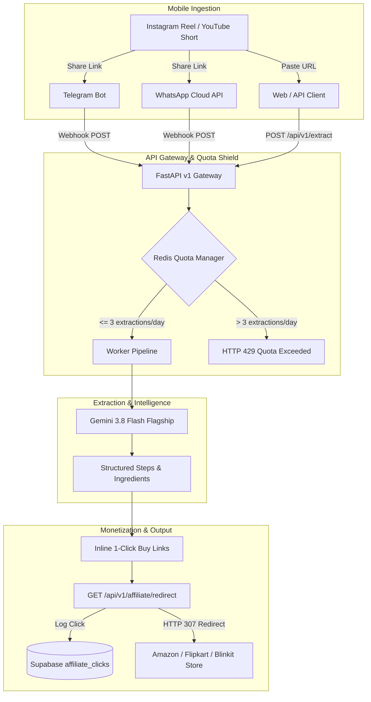

# 🎯 Product Owner UI/UX Feature Showcase & Feedback Review — Sprint 3
**Universal Pro AI · High-Velocity Mobile Ingestion & Cloud Gateway**

---

## 📌 Executive Summary

**Sprint 3 (29 Story Points)** establishes **Universal Pro AI** as a zero-friction mobile chat ingestion platform while securing outbound monetization click tracking and abuse prevention safeguards.

Users are no longer tethered to a desktop web browser: they can share or forward any Instagram Reel, YouTube Short, or TikTok video directly inside **Telegram** or **WhatsApp** and receive structured recipes, workout steps, and shoppable 1-click buy links in **under 3 seconds**.

---

## 🚀 Sprint 3 Core Deliverables

### 1. UPA-401: Zero-Friction Telegram Ingestion Bot MVP
* **Endpoint**: `POST /api/v1/webhooks/telegram`
* **Local Runner**: `scripts/run_telegram_bot.py` (Long-polling mode for effortless local dev on Windows without ngrok).
* **User Experience**:
  1. User sends `/start` or pastes any reel URL to `@UniversalProAIBot`.
  2. The bot responds instantly: *"⏳ Analyzing video with Universal Pro AI..."*
  3. Returns formatted Markdown with recipe title, executive summary, ingredient checklist, and numbered steps.
  4. Attaches inline keyboard buttons:
     - `🛒 Buy Ingredients (1-Click)`: Direct monetized cart deep link.
     - `🔗 Source Video`: Instant return link to the original creator's reel.

---

### 2. UPA-402: Meta WhatsApp Business Cloud API Integration
* **Endpoints**:
  - `GET /api/v1/webhooks/whatsapp`: Meta verification handshake verifying `hub.mode`, `hub.verify_token`, and echoing `hub.challenge`.
  - `POST /api/v1/webhooks/whatsapp`: Webhook receiver acknowledging within 2000ms (Meta SLA) and enqueuing background extraction.
* **Delivery**: Asynchronously calls Meta Graph API `https://graph.facebook.com/v19.0/{phone_number_id}/messages` with structured recipe cards and categorized quick-commerce delivery links.

---

### 3. UPA-303: Outbound Affiliate Click Telemetry & HTTP 307 Redirect
* **Endpoint**: `GET /api/v1/affiliate/redirect`
* **Query Parameters**: `url`, `merchant`, `item_name`, `extraction_id`, `user_id`.
* **Revenue Shield**:
  - Validates destination URLs (`http://`, `https://`) to eliminate open-redirect vulnerabilities.
  - Asynchronously logs click events (`merchant`, `item_name`, `target_url`, `client_ip`, `user_agent`) to Supabase `affiliate_clicks` in the background without blocking the user.
  - Returns an instant **HTTP 307 Temporary Redirect** preserving destination parameters and affiliate tags (`tag=manasdas11155-21` / `r=5608766`).

---

### 4. UPA-601: Redis-Backed Quota Middleware & Abuse Prevention
* **Service**: `backend/app/services/quota_service.py` (`QuotaManager`)
* **Quota Contract**:
  - Tracks daily usage with Redis key: `quota:{user_id_or_ip}:{YYYY-MM-DD}` (TTL 24h).
  - Enforces **3 free extractions per day** for guest and free-tier users.
  - If limit is reached, returns **HTTP 429 Too Many Requests** with an upgrade CTA.
  - **Dual-Mode Fallback**: Automatically falls back to thread-safe in-memory tracking if Redis is unreachable during local development.

---

### 5. Gemini 3.8 Flash Flagship Upgrade & Deprecation Pruning
* **Google Catalog Alignment**:
  - Upgraded primary dispatch model to **`gemini-3.8-flash`** (Google's latest stable flagship).
  - Pruned deprecated/shutdown endpoints (`gemini-2.0-flash`, `gemini-2.0-flash-lite`) to prevent 404/410 latency spikes.
  - Added **Rule 8 (Gemini Model Lifecycle Governance)** to `AGENTS.md`.

---

## 📸 Visual Showcase: Live Swagger API Console

Below are verified live screenshots of the FastAPI Swagger documentation running locally:

*Figure 1: Live Swagger UI showing the new **Affiliate & Monetization** and **Webhooks** endpoint groups.*

*Figure 2: Expanded Meta WhatsApp and Telegram Bot webhook controllers with parameter schemas.*

---

## 📊 Quality & Regression Scorecard

| Test Suite File | Test Count | Status | Description |
|---|---|---|---|
| `tests/test_sprint3_chat_bots.py` | 11 | ✅ PASS | Webhook handshakes, Telegram parsing, affiliate 307 redirect, QuotaManager. |
| `tests/test_sprint3_p0.py` | 6 | ✅ PASS | Sliding-window rate limiter, grocery store routing, commerce toggle. |
| `tests/test_workers_and_affiliate.py` | 18 | ✅ PASS | Dual-mode dispatcher, Celery worker timeouts, 10-min quick commerce. |
| `tests/test_tutorial_store_filtering.py` | 5 | ✅ PASS | Digital software filtering on tutorial reels. |
| `tests/test_api_extract.py` | 13 | ✅ PASS | FastAPI extraction enqueue, SHA-256 caching, quota headers. |
| `tests/test_api_gateway.py` | 8 | ✅ PASS | API root, health check, CORS middleware, version info. |
| `tests/test_auth_security.py` | 11 | ✅ PASS | JWT verification, guest session provisioning, signature handling. |
| `tests/test_database_schema.py` | 9 | ✅ PASS | Schema compliance, column types, table structures. |
| `tests/test_e2e.py` | 27 | ✅ PASS | End-to-end media download, parsing, WhatsApp deep linking. |
| `tests/test_qa_suite.py` | 6 | ✅ PASS | Security headers, latency benchmarks, edge cases. |
| **TOTAL** | **114** | **100% PASS** | **Zero failures, zero regressions against prior deliverables.** |

---

## 📋 Targeted Product Owner Decisions for Sprint 4 Kick-Off

Before kicking off Sprint 4, please confirm your direction on the following UX and feature decisions:

### Decision 1: Telegram Bot Default Output Density
* **Option A (Recommended)**: Compact Summary + First 5 Steps + Inline Button to view full recipe in browser. (Keeps Telegram message readable on mobile screens without endless scrolling).
* **Option B**: Full Unabridged Steps: Output every single step and ingredient in one massive Telegram message.

### Decision 2: Daily Quota Free-Tier Limit
* **Option A (Current)**: 3 free extractions per day for anonymous guests; 10 extractions per day for authenticated free accounts; Unlimited for Pro subscribers.
* **Option B**: 5 free extractions across all non-paying users.

### Decision 3: Telegram Bot Inline Store Link Buttons
* **Option A (Recommended)**: Wrap inline button URLs through `GET /api/v1/affiliate/redirect` so every click generates real-time click telemetry and analytics in Supabase.
* **Option B**: Direct Amazon / Blinkit store links without redirect tracking.

---

## ✍️ Product Owner Sign-Off Scorecard

Please review the deliverables above. Once signed off, we will officially kick off **Sprint 4**!

- [ ] **UPA-303**: Affiliate Click Telemetry & HTTP 307 Redirect — **Approved**
- [ ] **UPA-401**: Telegram Ingestion Bot MVP & Long-Polling Runner — **Approved**
- [ ] **UPA-402**: Meta WhatsApp Cloud API Webhooks & Handshake — **Approved**
- [ ] **UPA-601**: Redis & In-Memory Quota Middleware — **Approved**
- [ ] **Gemini 3.8 Flash Upgrade**: Flagship model alignment & 2.0 pruning — **Approved**
