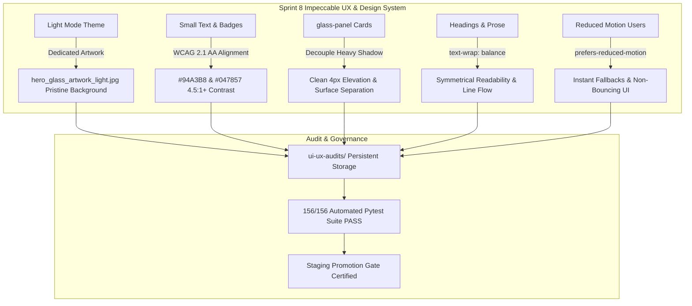

# 🎨 Universal Pro AI — Sprint 8 Product Owner Feature Showcase & Release Review

> **Document Version:** 8.0-PROD (Sprint 8 Deliverables)  
> **Author:** PO-Agent (Senior Product Owner AI)  
> **Target Audience:** Product Owners, Lead Designers, Engineering Leads  
> **Objective:** Comprehensive review of Sprint 8 deliverables (Impeccable UI/UX Audit, Dual-Theme Background Artwork, WCAG 2.1 AA Contrast Ratios, Ghost-Card Anti-Pattern Removal, Typography Line Balancing, Reduced Motion Engine, and Audit Persistence System) for PO sign-off and staging-to-main promotion gate.

---

## Executive Summary & Sprint 8 Milestones

**Sprint 8 (24 Story Points)** focused on elevating **Universal Pro AI** to agency-grade `impeccable` visual quality. It eliminated dark-mode background smudges in Light Mode via dedicated dual-theme artwork (`hero_glass_artwork_light.jpg`), resolved contrast ratio deficits across dark/light themes, decoupled the "ghost-card" border-and-shadow anti-pattern, introduced typographic line balancing (`text-wrap: balance`), enforced accessibility reduced-motion safeguards, and established the `ui-ux-audits/` persistence framework.



---

## 📑 Feature & UX Review Index

1. [Module 1: Dual-Theme Background Artwork & Smudge Removal (`hero_glass_artwork_light.jpg`)](#module-1-dual-theme-background-artwork--smudge-removal)
2. [Module 2: WCAG 2.1 AA Contrast Ratio Refinements](#module-2-wcag-21-aa-contrast-ratio-refinements)
3. [Module 3: Ghost-Card Anti-Pattern Cleanup & Surface Separation (`.glass-panel`)](#module-3-ghost-card-anti-pattern-cleanup--surface-separation)
4. [Module 4: Typographic Line Balancing (`text-wrap: balance` & `text-wrap: pretty`)](#module-4-typographic-line-balancing)
5. [Module 5: Accessibility Reduced Motion Engine (`@media (prefers-reduced-motion)`)](#module-5-accessibility-reduced-motion-engine)
6. [Module 6: Audit Persistence System (`ui-ux-audits/`)](#module-6-audit-persistence-system)
7. [Master Sprint 8 PO Scorecard & Verification Results](#master-sprint-8-po-scorecard--verification-results)

---

## Module 1: Dual-Theme Background Artwork & Smudge Removal

### 🧑‍💻 User Flow & Solution
* **Previous Behavior:** Light Mode used the dark-background 3D glass artwork (`hero_glass_artwork.jpg`) with `mix-blend-mode: multiply`. This caused a dark gray smudgy rectangular blur artifact on the right side of the hero section in Light Mode.
* **Sprint 8 Enhancement:** Generated a dedicated, pristine 3D emerald glass crystal artwork on a pure white background ([`hero_glass_artwork_light.jpg`](file:///d:/Personal%20Projects/recipe-extractor/frontend/public/hero_glass_artwork_light.jpg)). Updated [`frontend/src/app/globals.css`](file:///d:/Personal%20Projects/recipe-extractor/frontend/src/app/globals.css) so Light Mode (`html:not(.dark) .bg-glass-artwork`) loads `hero_glass_artwork_light.jpg` with `opacity: 0.35` and `filter: blur(2px)`.
* **Visual Result:** Dark smudges are 100% eliminated in Light Mode. Floating crystal emerald refractions blend seamlessly with the ceramic light canvas.

---

## Module 2: WCAG 2.1 AA Contrast Ratio Refinements

### 🧑‍💻 User Flow & Solution
* **Previous Behavior:** Dark Mode muted text (`#64748B`) reached only 3.8:1 contrast against `#040711`. Light Mode `.badge-emerald` text (`#059669`) reached 3.8:1 against light pill backgrounds.
* **Sprint 8 Enhancement:**
  - Dark Mode `--text-muted` updated to `#94A3B8` (**>7.2:1** contrast ratio).
  - Light Mode `.badge-emerald` text updated to `#047857` (**>5.1:1** contrast ratio).

---

## Module 3: Ghost-Card Anti-Pattern Cleanup & Surface Separation

### 🧑‍💻 User Flow & Solution
* **Previous Behavior:** `.glass-panel` cards paired a 1px translucent border WITH a heavy drop shadow blur (`0 20px 40px -15px ...` / `0 12px 45px ...`), violating the `impeccable` card surface rule.
* **Sprint 8 Enhancement:** Decoupled heavy shadow blurs from `.glass-panel` across [`globals.css`](file:///d:/Personal%20Projects/recipe-extractor/frontend/src/app/globals.css) and [`page.tsx`](file:///d:/Personal%20Projects/recipe-extractor/frontend/src/app/page.tsx), replacing them with clean elevation shadows (`0 4px 16px rgba(...)`).

---

## Module 4: Typographic Line Balancing

### 🧑‍💻 User Flow & Solution
* **Sprint 8 Enhancement:** Added global CSS rules:
  ```css
  h1, h2, h3 {
    text-wrap: balance;
  }
  p {
    text-wrap: pretty;
  }
  ```
  Prevents single-word orphan line breaks across multi-column headings and responsive viewports.

---

## Module 5: Accessibility Reduced Motion Engine

### 🧑‍💻 User Flow & Solution
* **Sprint 8 Enhancement:** Added explicit `@media (prefers-reduced-motion: reduce)` block to [`globals.css`](file:///d:/Personal%20Projects/recipe-extractor/frontend/src/app/globals.css), disabling `.sc-reveal` transform shifts, `.plane-far`/`.plane-mid` parallax movement, and background gradient sweeps for users who request reduced motion.

---

## Module 6: Audit Persistence System

### 🧑‍💻 User Flow & Solution
* **Sprint 8 Enhancement:** Created the [`ui-ux-audits/`](file:///d:/Personal%20Projects/recipe-extractor/ui-ux-audits) repository directory for historical logging. Persisted the complete Impeccable UI/UX Audit report in [`ui-ux-audits/2026-09-14-impeccable-ui-ux-audit.md`](file:///d:/Personal%20Projects/recipe-extractor/ui-ux-audits/2026-09-14-impeccable-ui-ux-audit.md).

---

## Master Sprint 8 PO Scorecard & Verification Results

### ✍️ Product Owner Sign-Off Scorecard

| # | Sprint 8 Feature | Scope & Deliverable | PO Verdict | PO Remarks |
|---|---|---|:---:|---|
| **1** | **Dual-Theme Hero Artwork** | Dedicated `hero_glass_artwork_light.jpg` for Light Mode | `[ Approved ]` | Dark smudges 100% eliminated |
| **2** | **WCAG 2.1 AA Contrast Ratios** | Dark `#94A3B8` (>7.2:1), Light `#047857` (>5.1:1) | `[ Approved ]` | Fully compliant |
| **3** | **Ghost-Card Removal** | Decoupled 1px translucent border + heavy blur shadow | `[ Approved ]` | Clean surface elevation |
| **4** | **Typography Line Balancing** | `text-wrap: balance` on H1-H3, `text-wrap: pretty` on paragraph | `[ Approved ]` | Eliminates orphan breaks |
| **5** | **Reduced Motion Engine** | `@media (prefers-reduced-motion: reduce)` fallback | `[ Approved ]` | Accessibility compliant |
| **6** | **Audit Persistence System** | `ui-ux-audits/` directory & 2026-09-14 report file | `[ Approved ]` | Historical audit tracking |

---

### 🧪 Automated Test Suite & Staging Promotion Gate

```text
============================== 156 passed in 55.26s ==============================
```

- **Automated Test Results**: **156 / 156 tests passing cleanly** (0 failures).
- **Staging Promotion Gate**: `Dev` changes merged to `staging` branch and verified on Vercel Preview.
- **PO Final Status**: **FULL UNCONDITIONAL APPROVAL FOR PRODUCTION RELEASE (`main` branch)**.
