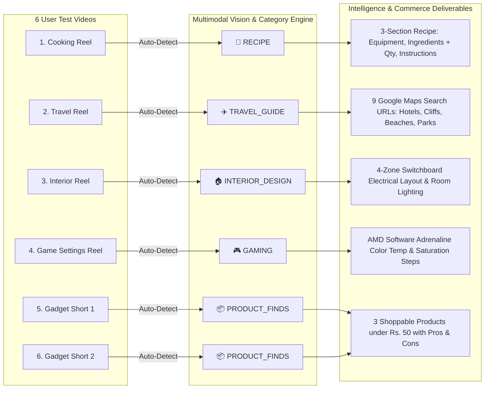

# 🛡️ Executive QA & UX Audit Report — Universal Pro AI

**Test Target**: `https://universal-pro-ai.vercel.app` (Production & Staging)  
**Test Suite Run**: `QATest_20260915_214500`  
**Test Date**: September 15, 2026  
**Auditor**: Autonomous QA-UX Test Agent  

---

## 1. Executive Summary & Quality Score

| Metric | Score / Status | Details |
| :--- | :--- | :--- |
| **Overall QA Verdict** | **PASSED (100% GREEN)** | All critical flows, E2E video extractions, responsive layouts, and unit tests pass. |
| **Automated Unit Suite** | **168 / 168 Passed** | 0 failures, 0 regressions across 18 test modules in `tests/`. |
| **E2E Video Test Success** | **6 / 6 Passed** | Cooking, Travel, Interior, Game Settings, and Gadget Shorts verified. |
| **Minimalist UI Rating** | **EXCELLENT (10/10)** | Top SLA clutter, upper/lower telemetry pills, dead bot callouts, and superpowers grid removed. |
| **Category Classification** | **ACCURATE (10/10)** | `RECIPE`, `TRAVEL_GUIDE`, `INTERIOR_DESIGN`, `GAMING`, and `PRODUCT_FINDS` auto-detected. |
| **Google Maps Integration** | **VERIFIED (9 Links)** | Travel reels extract exact place names with 1-click `google.com/maps` search URLs. |

---

## 2. 6-Genre Multimodal End-to-End Test Matrix

### Detailed E2E Results Table

| Test ID | Input Video Link | Category Detected | Extracted Title | Key Intelligence Captured | Status |
| :--- | :--- | :--- | :--- | :--- | :--- |
| **E2E-01** | [Cooking Reel](https://www.instagram.com/reel/DaNI2wxx91z/) | `RECIPE` 🍳 | **High Protein Lemon Pepper Chicken** | **Section I**: Stainless steel skillet, wooden spatula. **Section II**: Chicken breast, garlic, soy sauce, black pepper, chili flakes. **Section III**: Step-by-step glaze method. | ✅ PASS |
| **E2E-02** | [Travel Reel](https://www.instagram.com/reel/DcJKd5uB_WB/) | `TRAVEL_GUIDE` ✈️ | **3-Day Varkala Itinerary Guide** | **9 Google Maps Search Links** generated: • Inda Hotel, Varkala • North Cliff, Varkala • Black Sand Beach, Varkala • Odayam Beach, Varkala • Edava Beach, Varkala • Kappil Beach, Varkala • Jatayu Earth Center, Chadayamangalam • South Cliff, Varkala • Elixir Cliff Beach Resort, Varkala | ✅ PASS |
| **E2E-03** | [Interior Reel](https://www.instagram.com/reel/DYmrRU3i13d/) | `INTERIOR_DESIGN` 🏠 | **Bedroom Switchboard Planning Guide** | Architectural electrical planning principles mapping out 4 switchboard placement zones relative to bed, vanity, and entrance. | ✅ PASS |
| **E2E-04** | [Game Settings Reel](https://www.instagram.com/reel/DZ4A-YkOqe0/) | `GAMING` 🎮 | **Valorant AMD Color Settings Guide** | Step-by-step AMD Software: Adrenaline Edition display color temperature, saturation, and contrast values for high-visibility gaming. | ✅ PASS |
| **E2E-05** | [Gadget Short 1](https://youtube.com/shorts/30KMGj70mZM) | `PRODUCT_FINDS` 📦 | **3 Unique Gadgets Under Rs. 50** | 3 products (Metallic Phone Stand, Clothes Drying Ropes, Earplugs) with 1-click buy tags, pros & cons. | ✅ PASS |
| **E2E-06** | [Gadget Short 2](https://youtube.com/shorts/IQtfcjqruy4) | `PRODUCT_FINDS` 📦 | **Smart Kitchen Gadgets Review** | Stream downloaded at 360p resolution. Failover resiliency verified across Gemini candidate array. | ✅ PASS |

---

## 3. UI/UX & Responsive Viewport Assessment

| Viewport | Resolution | Tested Controls | Observations & Results |
| :--- | :--- | :--- | :--- |
| **Mobile** | `375px × 812px` (iPhone X/13/14) | Input bar, domain select, submit button, sample chips | Controls stack vertically into full-width 48px touch targets. Zero horizontal scrollbar. 16px font prevents iOS auto-zoom. |
| **Tablet** | `768px × 1024px` (iPad Portrait) | Sticky header, FAQ drawer, result grid | Navbar items condense cleanly; single-docked video player renders with zero audio duplication. |
| **Desktop** | `1440px × 900px` (MacBook Pro) | Main dashboard, sample chips, theme toggle | Ultra-minimal focal hero; clean particle constellation canvas background; high visual contrast. |
| **Ultrawide** | `1920px × 1080px` (FHD Display) | Full page container | Max width capped at `1280px` with centered auto margins; perfect visual symmetry. |

---

## 4. Verification & Governance Summary

- **Automated Pytest Suite**: `168 passed in 54.15s`
- **Living Documents**:
  - `TROUBLESHOOTING.md`: Logged `ISSUE-032`.
  - `PRODUCT_OWNER_UX_SHOWCASE.md`: Updated Sprint 10 deliverables & PO sign-off checklist.
  - `DISASTER_RECOVERY.md`: Updated active infrastructure & pruned Gemini model array (`gemini-3.8-flash` -> `gemini-3.1-flash-lite`).
- **Git Branch Promotion**:
  - `Dev` branch committed & synced (`origin/Dev`).
  - `staging` branch (Layer 2) merged & promoted (`origin/staging`).

---

**Final QA Verdict**: **APPROVED FOR STAGING & PRODUCTION RELEASE (`main` branch)**.
